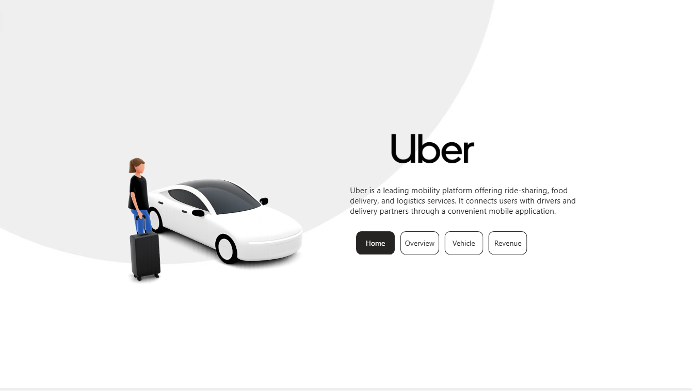
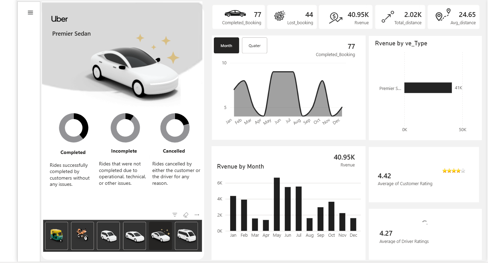
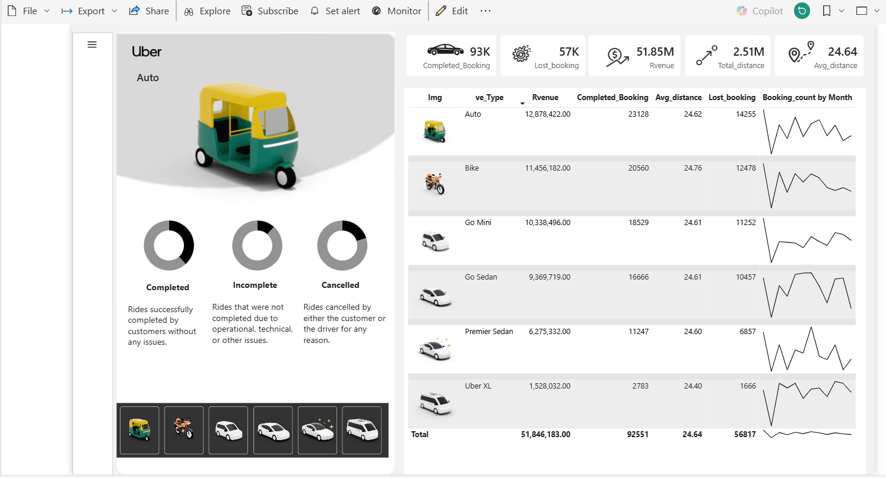
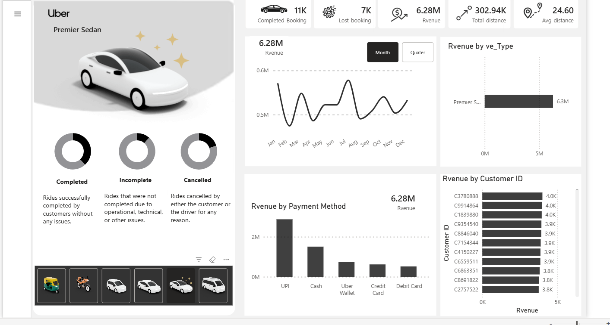

# Uber Ride Analysis – Power BI Dashboard

## About the Project

I created this Power BI project to analyze Uber ride booking data and understand booking trends, revenue, vehicle performance, customer behavior, and payment methods.

The dashboard is designed to make the data easy to understand through interactive visuals and key performance indicators.

## Tools Used

- Power BI
- Power Query
- DAX

## Dashboard Pages

### 1. Home
The home page gives a quick introduction to the project and provides navigation to the different analysis sections.

### 2. Overview
This page shows the overall booking performance, completed and lost bookings, revenue, distance, and customer ratings.

### 3. Vehicle Analysis
This page compares different vehicle types based on revenue, completed bookings, lost bookings, and average distance.

### 4. Revenue Analysis
This page focuses on revenue trends, payment methods, vehicle-wise revenue, and customer-wise revenue.

## Key Analysis

- Total completed and lost bookings
- Revenue generated from different vehicle types
- Monthly revenue trends
- Payment method analysis
- Average customer and driver ratings
- Vehicle-wise booking performance
- Distance analysis
- Customer-wise revenue

## Screenshots

### Home Page

### Overview

### Vehicle Analysis

### Revenue Analysis

## Conclusion

This project helped me practice data cleaning, data transformation, data visualization, and dashboard development using Power BI.

It also helped me understand how business data can be converted into useful insights for decision-making.
